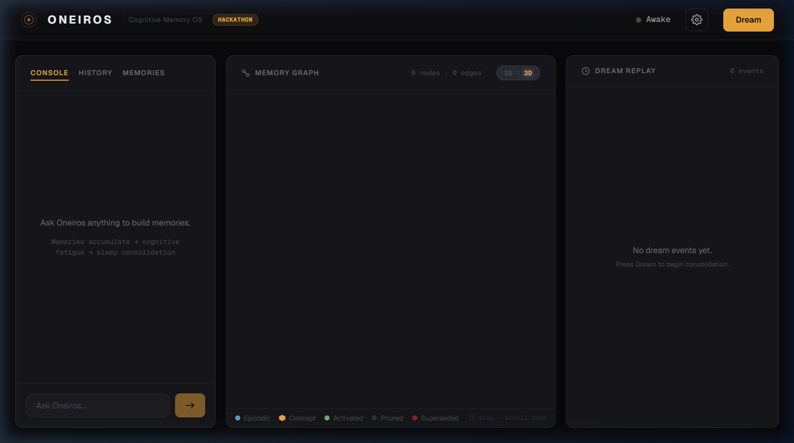
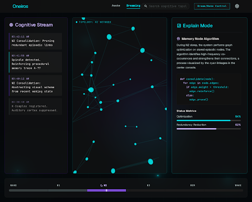
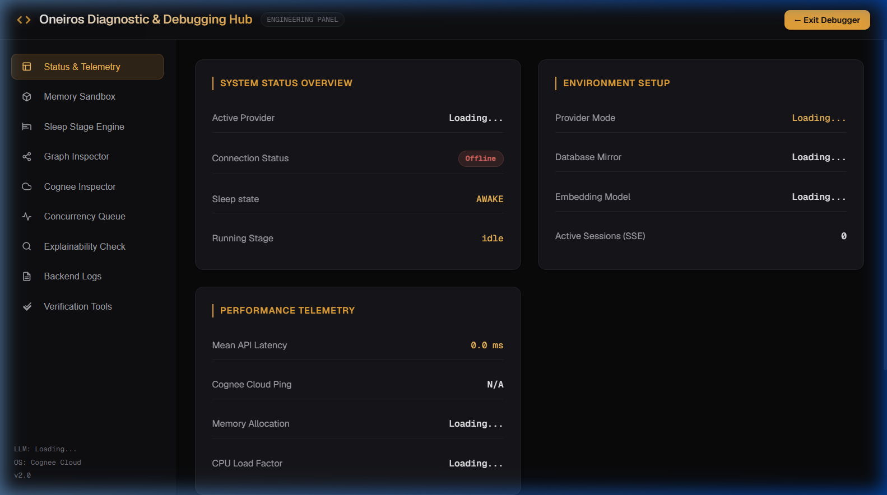
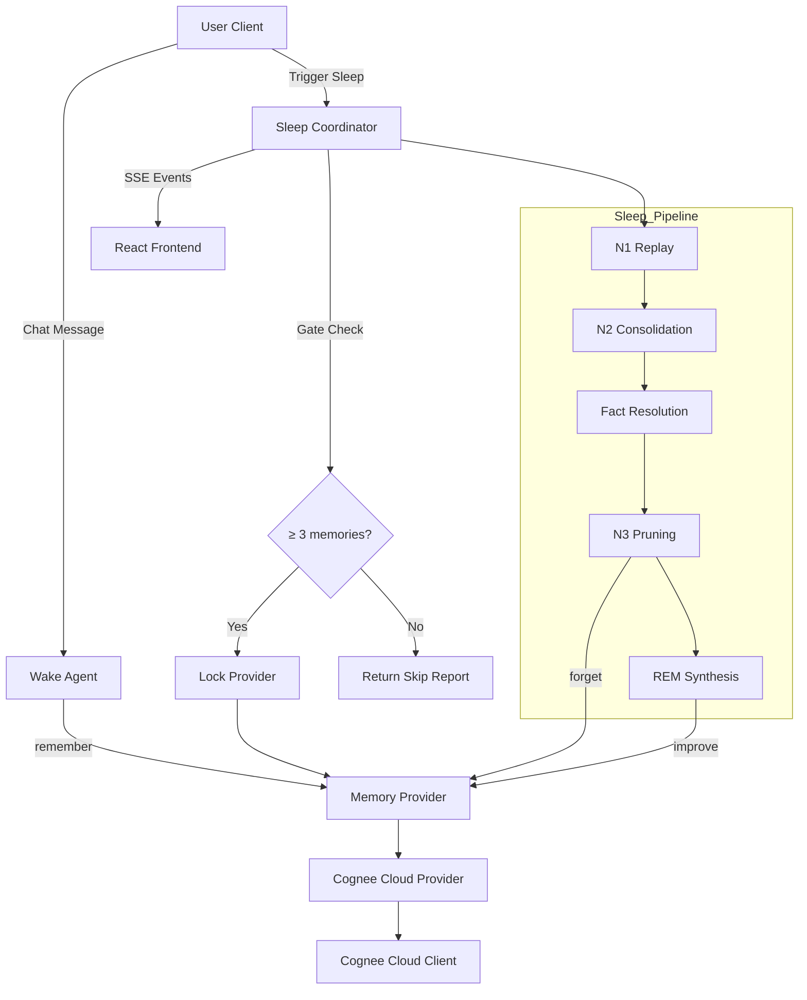

# 🌌 Oneiros Cognitive OS

[](https://www.wemakedevs.org/hackathons/cognee)
[](LICENSE)
[](backend/tests/)

> "AI agents continuously accumulate memories, but never truly sleep.
> Oneiros introduces a biological sleep cycle for AI—replaying, consolidating, pruning, and abstracting memories to keep long-term cognition healthy."

---

## 📅 7-Day Build Plan & Execution Timeline (June 29 – July 5)

| Date | Phase | Deliverables Built & Status |
| :--- | :--- | :--- |
| **June 29** | **Day 1: Foundation & Dependency Inversion** | <ul><li>✅ Created project structure & domain schemas (`MemoryNode`, `MemoryEdge`, `DreamReport`)</li><li>✅ Designed abstract `MemoryProvider` contract preventing circular dependencies</li><li>✅ Initialized wake chat session handler (`WakeAgent`) and stages coordinator</li></ul> |
| **June 30** | **Day 2: Sleep Stages & Cognitive Algorithms** | <ul><li>✅ Built **N1 Replay** implementing weighted exponential activation decay</li><li>✅ Built **N2 Consolidation** with DBSCAN semantic clustering (via scikit-learn)</li><li>✅ Built **N3 Pruning** with auto-merge ($\ge 0.995$), LLM validator ($\ge 0.90$), & contradiction prune</li><li>✅ Built **REM Abstraction** creating concept nodes & cross-cluster latent linking</li></ul> |
| **July 1** | **Day 3: Cloud Migration, 3D Graph & Clean Audit** | <ul><li>✅ Migrated memory layer to **Cognee Cloud** via `CogneeClient` and `CogneeCloudProvider`</li><li>✅ Implemented **asynchronous write lock & queue** synchronization during sleep stages</li><li>✅ Built **WebGL Synaptic Shader Background** and **Three.js 3D Graph Viewport**</li><li>✅ Performed complete backend audit, deleting 12 dead files & securing concurrency via `asyncio.Lock()`</li></ul> |
| **July 2** | **Day 4: Developer Console & Page Layout Optimization** | <ul><li>✅ Developed collapsible Developer Drawer console (`DevDrawer.tsx`) to query status and run stages</li><li>✅ Added debug router endpoints (`/api/debug/status`, `/api/debug/config`, `/api/debug/stage`, `/api/debug/reset`)</li><li>✅ Optimized dashboard grid layouts and panel heights to enable viewport-constrained scrolling</li></ul> |
| **July 3** | **Day 5: Graph UX, Deletion, Fallbacks & Cognitive Gate** | <ul><li>✅ Added **2D/3D graph toggle** — force-directed 2D canvas view alongside the 3D Three.js view</li><li>✅ Fixed **tooltip sticky bug** — tooltip clears immediately on mouse-leave in both 2D and 3D views</li><li>✅ Removed node labels from 2D canvas — decluttered, only hover tooltip shows content</li><li>✅ Added **per-node delete** — hover tooltip shows 🗑 Delete button with confirmation</li><li>✅ Added **Clear All memories** — header button with full-panel overlay confirmation</li><li>✅ Filtered Cognee internal nodes (`text_<hash>`, `#textdocument`, `#dataset`, `user:<hash>`, `oneiros_*`) from graphs and lists</li><li>✅ Fixed memories endpoint to **fall back to Cognee Cloud** when SQLite mirror is empty (e.g. after reset)</li><li>✅ Implemented **Cognitive Dream Gate** — sleep cycle skips automatically when there are fewer than 3 real episodic memories, returning a skip report</li></ul> |
| **July 4** | **Day 6: Full-Page Observatory Dev Console & Cleanups** | <ul><li>✅ Replaced developer drawer with a full-page **Developer Console Page** (at `#/debug`) containing 15 diagnostic sections, testing utilities, self-tests, and real-time backend log streaming</li><li>✅ Redesigned Developer Console styling to use the "Warm Observatory" palette and local Geist fonts</li><li>✅ Added background auto-connection status check triggering Cognee serve connect automatically on startup</li><li>✅ Stripped navigation emojis, replacing them with modern inline vector SVG icons</li><li>✅ Cleaned up workspace folder structure, deleting prompt design reference files, redundant sliding drawer files, and empty ignored folders from Git tracking (`backend/backend`, `backend/scripts`, `backend/data`)</li></ul> |
| **July 5** | **Day 7: Performance Verification & Launch** | <ul><li>🟡 Preparing technical explanation documentation and final review</li></ul> |

---


## ⚠️ The Problem

Current AI architectures treat memory as a flat database. As agents interact with users, they continuously append raw experience statements. 
This approach leads directly to:
*   **Cognitive Overload**: The agent's context window grows endlessly with noise.
*   **Duplicate Memories**: Minor variations of the same event clutter retrieval keys.
*   **Logical Contradictions**: Conflicting statements remain unresolved.
*   **Retrieval Decay**: Over time, search algorithms struggle to locate relevant long-term contexts, degrading the agent's response quality.

---

## 💡 The Idea: Biological Sleep for AI

Oneiros brings the human sleep-wake cycle directly to artificial intelligence. Instead of keeping the agent in a state of constant, awake ingestion, Oneiros splits cognition into two phases:

1.  **☀️ Wake Mode (Ingestion)**: The agent talks to the user normally. Every message is recorded as a raw experience node.
2.  **🌙 Sleep Mode (Consolidation)**: The user initiates a sleep cycle. The system executes a sequential pipeline:
    *   **Replay**: Ranks and selects important memories.
    *   **Cluster**: Groups semantically related experiences.
    *   **Prune**: Merges duplicate events and resolves logical contradictions.
    *   **REM**: Synthesizes parent abstract concepts and links related topics.
3.  **☀️ Wake Again**: The agent wakes up with a clean, optimized, and hierarchically organized knowledge graph.

> **Cognitive Gate**: If there are fewer than 3 episodic memories at sleep trigger time, the cycle is skipped automatically and a clear reason is returned. The agent will not dream when there is nothing to consolidate.

---

## 🎨 Demo & Visual Showcase

Oneiros features a high-fidelity dark glassmorphism dashboard built with a real-time WebGL fragment shader background and a Three.js 3D force-directed network viewport.

### ☀️ Active Ingestion (Awake State)
The agent interacts with the user, showing live memory node additions in the 3D synaptic space.


### 🌙 Cognitive Consolidation (Dreaming State)
The dashboard shifts into a dreaming console, visually replaying, clustering, pruning, and synthesizing concepts.


### 🛠️ Developer & Diagnostic Console (Engineering Panel)
Accessible via `#/debug`, this view exposes real-time telemetry, sandbox controls, live SSE event buffers, database resets, and self-testing suites.


---

## 🏆 Why Cognee?

Oneiros relies entirely on **[Cognee](https://github.com/cognee/cognee)** as its core cognitive memory substrate. Cognee is fundamental because it provides:
*   **Semantic Graph Structures**: Storing memories as nodes and edges rather than flat text vectors.
*   **Memory Provenance**: Documenting the relationships, associations, and origin chains of every episodic node.
*   **Dynamic Graph Queries**: Enabling real-time retrieval of sub-graphs to render on the Three.js viewport.
*   **Ontology Expansion**: Allowing Oneiros algorithms to safely create parent Concepts and associate topic networks directly on top of Cognee's database.

Rather than replacing Cognee, Oneiros acts as a cognitive orchestration layer, invoking Cognee's lifecycle APIs directly to evolve long-term memory.

---

## ⚙️ System Architecture

Oneiros adheres to a strict clean architecture separating domain schemas, cognitive processing, infrastructure adapters, and API endpoints.



---

## 🌀 Cognitive Sleep Pipeline

During sleep mode, memories flow sequentially through four biological stages to consolidate and prune the graph:

```
[ Ingested Raw Memories ] ➔ [ Gate Check ] ➔ [ N1: Replay Decay ] ➔ [ N2: DBSCAN Grouping ] ➔ [ Fact Resolution ] ➔ [ N3: Duplicate Merge ] ➔ [ REM: Concept Synthesis ] ➔ [ Rested Graph ]
```

*   **Gate Check**: Verifies ≥ 3 real episodic memories exist before running. Skips gracefully if not.
*   **N1 Replay**: Ranks memories using a time-decayed activation score, filtering the most relevant nodes.
*   **N2 Consolidation**: Groups semantically related experiences in coordinate spaces using DBSCAN and cosine distance.
*   **Fact Resolution**: Resolves structured fact conflicts (e.g. name updates) before pruning.
*   **N3 Pruning**: Merges duplicates and resolves conflicting logic statements using LLM checks.
*   **REM Abstraction**: Synthesizes parent topic Concepts and links them with latent associations.

*Detailed equations and algorithmic parameters are documented in the [Cognitive Research & Validation Log](docs/cognitive_research_validation.md).*

---

## ⚡ Key Features

*   **🧠 Cognitive Sleep Cycle**: Algorithmic pipeline replaying, clustering, merging, and abstracting memories.
*   **🛌 Cognitive Dream Gate**: Sleep is automatically skipped when there are no meaningful memories to consolidate — mirroring biological sleep behavior.
*   **🔮 2D / 3D Dual Graph View**: Toggle between a force-directed 2D canvas view and the 3D Three.js synaptic space. Nodes are circles (episodic) and hexagons (sleep concepts).
*   **🗑️ Memory Management**: Delete individual memories via hover tooltip or wipe all memories with Clear All — both update the graph live.
*   **🔒 Concurrency-Safe Sync**: Write-locking queue that caches incoming user writes during sleep execution to avoid database corruptions.
*   **🛡️ Concurrency Guard**: Coroutine-safe `asyncio.Lock()` preventing simultaneous sleep cycle executions.
*   **☁️ Cognee Cloud Ready**: Full abstraction integration mapping local operations directly to Cognee Cloud. SQLite acts as a local mirror with automatic fallback to Cloud when the mirror is empty.
*   **📈 Telemetry Explainability**: Timeline events, metrics summaries, and detailed stage execution traces.
*   **🔬 Developer Console**: Isolated stage controls, provenance explorer showing real memories, live SSE event log.

---

## 🔬 Technical Details & Mathematics

Oneiros implements formal mathematical models to drive memory operations:
*   **Weighted Activation Decay**: Node activation scores decay exponentially: $A_i = (W_r R_i + W_f F_i + W_c C_i + W_i I_i) \cdot e^{-\lambda t}$.
*   **Semantic Distance**: Nodes are clustered using Cosine Similarity: $\text{Distance}(u, v) = 1 - \frac{u \cdot v}{\|u\|_2 \|v\|_2}$.
*   **Ontology Links**: Links parent concepts if their cosine similarity is $\ge 0.40$.

*For complete derivations and parameter coefficients, read the [Cognitive Research & Validation Log](docs/cognitive_research_validation.md).*

---

## 🛠️ Tech Stack

*   **Backend Framework**: FastAPI (Python 3.13)
*   **Memory Substrate**: Cognee SDK (LanceDB vector store + SQLite relational graph)
*   **Reasoning Engine**: Google Gemini API via custom ReasoningEngine
*   **Frontend Interface**: Vite + React 19 + TypeScript
*   **WebGL Rendering**: Three.js + Custom GLSL fragment shader + Canvas 2D (2D graph mode)
*   **Synchronization**: Asynchronous Lock & SQLite caching with Cloud fallback

---

## 📂 Project Structure

*   [backend/](file:///c:/Users/nagendra%20prasad/Downloads/oneiros/backend) — FastAPI server, API endpoints, algorithms, and provider implementations.
*   [frontend/](file:///c:/Users/nagendra%20prasad/Downloads/oneiros/frontend) — Vite React dashboard interface, WebGL shaders, Three.js and Canvas 2D viewports.
*   [docs/](file:///c:/Users/nagendra%20prasad/Downloads/oneiros/docs) — Research logs, development timeline tracking, and repository architecture specifications.

*For a detailed file-by-file roadmap, see the [Folder Structure Log](docs/folder_structure.md).*

---

## 🚀 Getting Started

### 1. Configuration
Create a `.env` file in the workspace root directory:
```env
# API Credentials
GEMINI_API_KEY=your_gemini_api_key
COGNEE_API_KEY=your_cognee_api_key
COGNEE_BASE_URL=your_cognee_aws_tenant_url   # Optional (required for cloud tenant endpoints)
GROQ_API_KEY=your_groq_api_key               # Optional (if running llama models on Groq)
LLM_MODEL=groq/llama-3.3-70b-versatile       # Optional (override model selection)
```

### 2. Startup Commands
*   **Start Backend**:
    ```bash
    pip install -r requirements.txt
    python backend/app.py
    ```
*   **Start Frontend**:
    ```bash
    cd frontend
    npm install
    npm run dev
    ```

---

## 📡 API Reference

| Method | Endpoint | Description |
| :--- | :--- | :--- |
| `POST` | `/api/chat` | Send a message; stored as episodic memory |
| `GET` | `/api/chat/memories` | List all real user memories (internal nodes filtered) |
| `DELETE` | `/api/chat/memories/{id}` | Delete a single memory node by ID |
| `DELETE` | `/api/chat/memories` | Wipe all memories |
| `POST` | `/api/sleep/start` | Trigger a sleep consolidation cycle (gated) |
| `GET` | `/api/sleep/status` | Current sleep state (`idle` / `dreaming` / `complete`) |
| `GET` | `/api/sleep/events` | SSE stream of real-time VisEvents |
| `GET` | `/api/graph` | Current graph nodes and edges |
| `GET` | `/api/graph/snapshots` | Stage-by-stage graph snapshots for temporal playback |
| `GET` | `/api/dream-report` | Latest DreamReport (or skip report) |
| `GET` | `/api/metrics` | Latest algorithm metrics snapshot |
| `POST` | `/api/debug/reset` | Wipe all Cognee Cloud data and SQLite mirror |
| `POST` | `/api/debug/stage` | Run an isolated pipeline stage (Developer Mode, bypasses gate) |

---

## 🧪 Testing

The backend includes a comprehensive pytest suite covering API controllers, event messaging, and sleep stage consolidation algorithms:
```bash
python -m pytest backend/tests/
```

---

## 🔮 Future Work

*   **Adaptive Decay Learning**: Self-learning decay rates based on user access frequencies.
*   **Multi-Agent Shared Graphs**: Shared sleep consolidation pipelines for collaborative agents.
*   **Distributed Substrates**: Integrating decentralized vector networks.

---

## 🤖 AI Assistant Disclosure

This project was built pair-programming with the **Antigravity AI coding assistant** (Google DeepMind team) to co-author, optimize, and clean the repository structures.

---

## 📄 License

This project is licensed under the MIT License. See [LICENSE](LICENSE) for details.
