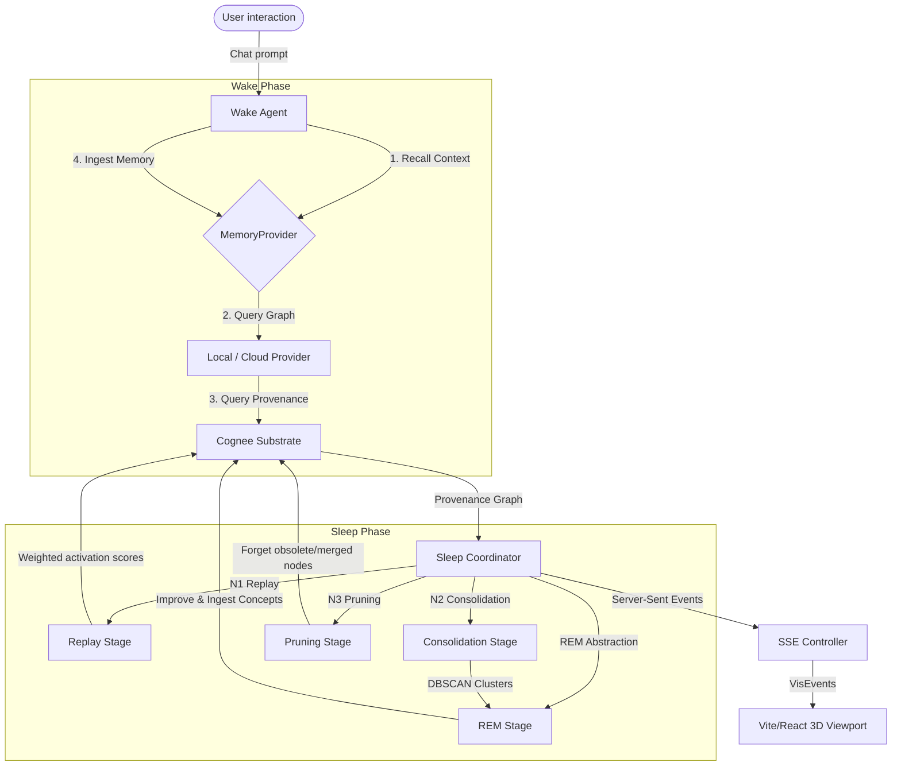

# 🌌 Oneiros Cognitive OS

> [!IMPORTANT]
> **🏆 Official Hackathon Submission Build**: Oneiros is built for the [WeMakeDevs Cognee Hackathon](https://www.wemakedevs.org/hackathons/cognee). It showcases observable, inspectable AI memory consolidation pipelines in a high-fidelity 3D web console, mapping out how an agent sleeps, consolidates, and forgets semantic memories.

Oneiros is an **observable, inspectable cognitive memory operating system** built on top of [Cognee](https://github.com/cognee/cognee) to simulate the human sleep-wake cycle for artificial intelligence. 

Instead of treating memory as a flat database, Oneiros models memory as a **living, evolving semantic graph** that experiences wakeful ingestion, consolidation, pruning, and abstract concept synthesis.


---

## 📅 7-Day Build Plan & Execution Timeline (June 29 – July 5)

| Date | Phase | Deliverables Built & Status |
| :--- | :--- | :--- |
| **June 29** | **Day 1: Foundation & Dependency Inversion** | <ul><li>✅ Created project structure & domain schemas (`MemoryNode`, `MemoryEdge`, `DreamReport`)</li><li>✅ Designed abstract `MemoryProvider` contract preventing circular dependencies</li><li>✅ Initialized wake chat session handler (`WakeAgent`) and stages coordinator</li></ul> |
| **June 30** | **Day 2: Sleep Stages & Cognitive Algorithms** | <ul><li>✅ Built **N1 Replay** implementing weighted exponential activation decay</li><li>✅ Built **N2 Consolidation** with DBSCAN semantic clustering (via scikit-learn)</li><li>✅ Built **N3 Pruning** with auto-merge ($\ge 0.995$), LLM validator ($\ge 0.90$), & contradiction prune</li><li>✅ Built **REM Abstraction** creating concept nodes & cross-cluster latent linking</li></ul> |
| **July 1** | **Day 3: Cloud Migration, 3D Graph & Clean Audit** | <ul><li>✅ Migrated memory layer to **Cognee Cloud** via `CogneeClient` and `CogneeCloudProvider`</li><li>✅ Implemented **asynchronous write lock & queue** synchronization during sleep stages</li><li>✅ Built **WebGL Synaptic Shader Background** and **Three.js 3D Graph Viewport**</li><li>✅ Performed complete backend audit, deleting 12 dead files & securing concurrency via `asyncio.Lock()`</li></ul> |
| **July 2** | **Day 4: Context Compression & Graph Optimization** | <ul><li>🟡 Refining vector retrieval queries to summarize high-degree memory hubs</li><li>🟡 Integrating cognitive context limits to manage window overhead</li></ul> |
| **July 3** | **Day 5: Error Isolation & Persistence Cache** | <ul><li>🟡 Implementing resilient retry decorators on Cognee Cloud client commands</li><li>🟡 Caching coordinate layout mappings locally in SQLite backup layers</li></ul> |
| **July 4** | **Day 6: Tactile Audio & Interface Polish** | <ul><li>🟡 Integrating dynamic sound cues for dashboard buttons & stage transitions</li><li>🟡 Polishing glassmorphism layouts, overlay panels, and responsive grids</li></ul> |
| **July 5** | **Day 7: Performance Profiling & Launch** | <ul><li>🟡 Performance scaling verification & final project package deployment</li></ul> |

---

## 🎨 Observable Cognition (Interactive Dashboard)

Oneiros transitions from a background memory layer into an interactive, real-time console with two distinct operational state modes:

### ☀️ Awake State (User Interaction & Memory Ingestion)
*   **Agent Console**: Standard chat workspace where users interact with the Oneiros agent.
*   **Memory Ingestion**: Each interaction is recorded as a raw episodic memory node in the Cognee substrate.
*   **Live Memory Graph**: A dynamic Three.js 3D force-directed network rendered on the background, visually reflecting newly ingested nodes.

### 🌙 Dreaming State (Sleep Consolidation & Abstraction)
*   **Visual sleep cycle playback**: Users trigger a sleep cycle, transforming the workspace into a dreaming console.
*   **3D Network Viewport**: Meshes smoothly interpolate (lerp) coordinates during stage transitions.
    *   **Episodic Memories** are represented as floating glowing spheres.
    *   **Abstract Concepts** are represented as 3D hexagonal cylinders.
*   **Temporal Playback Scrubber**: Drag-and-drop timeline scrubber to travel step-by-step between sleep phases.
*   **Explain Panel (Audit Trail)**: Clicking any node or metric exposes the exact **Input ➔ Algorithm ➔ Output** trace.

---

## 🏗️ System Architecture & Data Flow

The system is designed with a strict clean boundary: **Infrastructure** owns connectivity, **Providers** handle memory translation, **Kernel** executes algorithm logic, and the **Frontend** acts purely as a visualization renderer.



---

## 🧠 Core Cognitive Algorithms (N1 ➔ REM)

### 📊 N1 Stage: Replay (Weighted Activation Decay)
During Replay, memories are ranked by an activation score to determine which items enter the active consolidation working set. The activation $A_i$ of node $i$ decays exponentially over time:

$$A_i = (W_r \cdot R_i + W_f \cdot F_i + W_c \cdot C_i + W_i \cdot I_i) \cdot e^{-\lambda t}$$

Where:
*   $R_i$: **Recency score** (time elapsed since last access)
*   $F_i$: **Frequency score** (total access count)
*   $C_i$: **Graph centrality** (relative degree centrality of the node)
*   $I_i$: **Importance weight** (assigned during ingestion)
*   $\lambda$: **Decay rate** ($0.1$ default)

---

### 🧮 N2 Stage: Consolidation (DBSCAN Clustering)
Activated working nodes are projected into embedding spaces. A DBSCAN algorithm groups semantically close memories using cosine distance metrics:

$$\text{Distance}(u, v) = 1 - \frac{u \cdot v}{\|u\|_2 \|v\|_2}$$

*   **Epsilon ($\epsilon$)**: $0.25$ (maximum distance between nodes to form a cluster)
*   **Min Samples**: $1$ (allows isolated singleton memory clusters)

---

### ✂️ N3 Stage: Pruning (Duplicate Merge & Contradiction Resolution)
To optimize storage density and health, the system detects logical redundancies and conflicts:
*   **Auto-Merge**: Duplicate candidates with cosine similarity $\ge 0.995$ are merged directly.
*   **LLM Verification**: Candidates with similarity $\ge 0.90$ are dispatched to the Gemini Reasoning Engine for semantic duplicate checking.
*   **Contradiction Resolution**: Logical contradiction pairs are detected and resolved by pruning the logically invalid or older statement.

---

### 🔮 REM Stage: Abstraction (Ontology Synthesis & Latent Linking)
The system synthesizes new knowledge from clusters:
1.  **Concept Creation**: LLM abstracts experiences in a cluster, generating a new parent `Concept` node.
2.  **Abstraction Edges**: `ABSTRACTED_BY` relationship edges connect child memories to the new Concept.
3.  **Latent Topic Linking**: Pairs of Concepts are compared. If semantic similarity is $\ge 0.40$, an `ASSOCIATED_WITH` relationship is generated to link different topic clusters.

---

## 🛡️ Thread-Safe Memory Synchronization

To prevent user interactions during sleep cycles from corrupting active graph consolidations, Oneiros implements a write-locking sync queue:

```
Sleep Cycle Initiated
         ↓
Provider Lock set (is_sleeping = True)
         ↓
User sends message ➔ Ingestion caught ➔ Temp ID queued (queued-xxxx)
         ↓
Sleep Stage processing runs uninterrupted on Cognee
         ↓
Sleep Cycle Complete
         ↓
Provider Lock released (is_sleeping = False)
         ↓
Queued memories flushed ➔ Processed sequentially in Cognee Cloud
```

---

## 💻 Tech Stack & Project Structure

### Backend
*   **Framework**: FastAPI (python 3.13)
*   **AI Memory Substrate**: Cognee SDK (LanceDB vector store + SQLite relational graph)
*   **LLM & Reasoning**: Google Gemini API via custom ReasoningEngine
*   **Testing**: Pytest & Asyncio Mock suites

### Frontend
*   **Core**: Vite + React 19 + TypeScript
*   **WebGL Layer**: Custom GLSL fragment shader displaying interactive synaptic background grids
*   **3D Network Space**: Three.js scene rendering spheres (episodic), hexagons (concepts), and line edges with camera mouse orbit controls.
*   **Styling**: Modern dark glassmorphism (Vanilla CSS)

---

## 🚀 Getting Started

### 1. Configuration
Create a `.env` file in the workspace root directory:
```env
# Provider selection: local | cloud
ONEIROS_PROVIDER=local

# Gemini
GEMINI_API_KEY=your_gemini_api_key

# Cognee Cloud (required only when ONEIROS_PROVIDER=cloud)
COGNEE_API_KEY=your_cognee_api_key
COGNEE_BASE_URL=https://api.cognee.ai/v1  # (Optional)

# Paths
DATABASE_PATH=backend/data/local_brain.db
```

### 2. Backend Setup
```bash
# Install dependencies
pip install -r requirements.txt

# Start FastAPI server
python backend/app.py
```
The backend API is now running at `http://127.0.0.1:8000`.

### 3. Frontend Setup
```bash
# Navigate to frontend folder
cd frontend

# Install Node modules
npm install

# Start local Vite server
npm run dev
```
Open `http://localhost:5173` in your browser.

### 4. Running Tests
```bash
# Run pytest unit test suite
python -m pytest backend/tests/
```

---

## 📄 License
This project is licensed under the MIT License.
